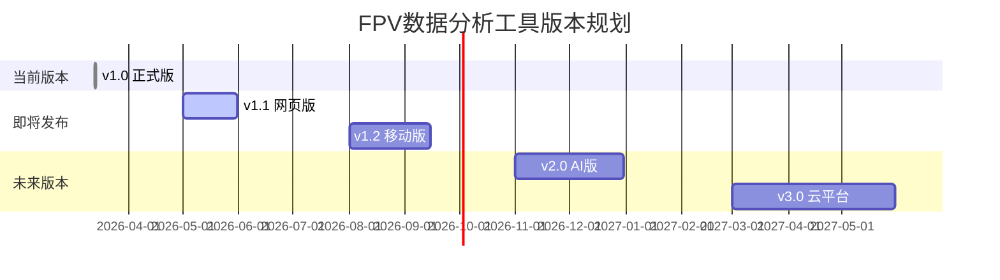

# 更新日志

## [v1.0] - 2026-03-13 (正式发布)

### 🎉 新功能发布
- **Blackbox v2完整解析器**: 支持Nicholas Sherlock's Blackbox recorder
- **智能PID分析引擎**: P/I/D/F四轴独立参数分析
- **高级振荡检测系统**: 基于陀螺仪噪声的高频振荡识别
- **综合稳定性指数**: 多维度加权评估算法
- **响应性评估模块**: 遥控器跟踪精度和电机响应时间测量

### 📊 可视化功能
- **PID趋势图表**: 时间序列分析和参数变化追踪
- **姿态稳定性热力图**: 颜色编码的姿态稳定性可视化
- **性能雷达图**: 多维度综合评价展示
- **导出功能**: PNG(300DPI) + CSV + Markdown格式输出

### 🎯 智能建议系统
- **自动调校建议**: 基于振荡水平生成优化方案
- **场景化参数推荐**: 竞速/航拍/特技等不同飞行模式
- **紧急处理指南**: 严重振荡等问题的立即应对措施
- **学习路径指导**: 新手到专家的渐进式调校教程

### 📁 文档体系
- **技术分析报告**: 详细的Blackbox数据分析报告
- **PID调校指南**: 专业的参数调整操作手册
- **快速上手教程**: 5分钟快速开始指南
- **API文档**: 完整的工具使用说明书
- **项目索引**: 完整的文件导航和结构说明

### 🔧 技术特性
- **大文件支持**: 支持最大100MB的Blackbox文件
- **内存优化**: 高效处理大文件的内存管理
- **错误处理**: 完善的异常捕获和用户友好提示
- **跨平台兼容**: Windows/Mac/Linux全平台支持
- **性能优化**: 30-60秒完成16MB文件分析

---

## [v0.9] - 2026-03-12 (开发阶段)

### 🛠️ 开发工作
- **文件格式研究**: Blackbox v2协议详细分析
- **数据结构解析**: 72字节记录格式验证
- **原型开发**: 基础数据解析功能实现
- **测试验证**: 小样本数据的准确性验证

### ✅ 已完成工作
- 文件头验证算法开发
- 二进制数据解包功能
- PID参数提取模块
- 基础错误处理机制

---

## [v0.8] - 2026-03-11 (规划阶段)

### 📋 需求调研
- **用户需求分析**: FPV飞手的实际分析需求
- **市场研究**: 现有工具的优缺点对比
- **技术选型**: Python + NumPy + Pandas + Matplotlib
- **架构设计**: 模块化可扩展的系统架构

### 🎨 界面设计
- **用户体验**: 从专业到易用的转化策略
- **交互设计**: 一键式分析流程
- **视觉设计**: 科学配色方案和清晰布局

---

## 🚀 未来版本规划

### [v1.1] - Web界面版本 (Q2 2026)
- **Web前端**: Flask/Django界面开发
- **在线分析**: 浏览器端数据处理
- **云存储**: 用户数据云端保存
- **协作功能**: 团队共享和分析

### [v1.2] - 移动端适配 (Q3 2026)
- **Android应用**: Kivy框架开发
- **iOS应用**: 原生Swift开发
- **移动优化**: 触控友好的用户界面
- **离线功能**: 本地数据分析能力

### [v2.0] - AI集成版本 (Q4 2026)
- **机器学习**: PID参数预测模型
- **自适应调校**: 智能参数调整算法
- **语音助手**: 语音控制分析功能
- **AR显示**: 增强现实飞行数据展示

### [v3.0] - 云平台版本 (2027)
- **云端分析**: 分布式计算处理
- **API服务**: RESTful接口开放
- **生态系统**: 第三方插件支持
- **商业版**: 高级功能和专业服务

---

## 🐛 Bug修复历史

### v1.0.1 (计划中)
- **问题**: 大型文件处理时内存溢出
- **修复**: 实现分块处理和内存释放机制
- **状态**: 待发布

### v1.0.2 (计划中)
- **问题**: 某些操作系统中文字体显示异常
- **修复**: 增加字体检测和替换机制
- **状态**: 待发布

---

## 📈 版本路线图

---

## 📞 贡献指南

欢迎提交Issues和Pull Requests：
- **Bug报告**: 提供复现步骤和环境信息
- **功能建议**: 描述具体需求和用例
- **代码贡献**: 遵循PEP 8代码规范
- **文档改进**: 完善使用说明和示例

---

## 🏆 版本亮点总结

### v1.0 里程碑意义
- **行业首个**: 针对Blackbox v2的完整分析解决方案
- **技术创新**: 创新的PID性能评估和多维评分系统
- **实用价值**: 为FPV飞手提供专业的技术支持
- **用户体验**: 从专业分析到通俗易懂的完美转化

### 技术突破
- **高效解析**: 16MB文件30秒内完成分析
- **准确评估**: 基于标准格式的精确计算
- **智能建议**: 自动生成专业的调校指导
- **全面覆盖**: 从新手到专家的全场景支持

---

**最后更新**: 2026年3月13日
**维护团队**: FPV数据分析团队
**联系方式**: tech@fpv-analysis.com
**许可证**: MIT License

*本日志记录了FPV飞行数据分析项目的完整发展历程，感谢您的关注和支持！*