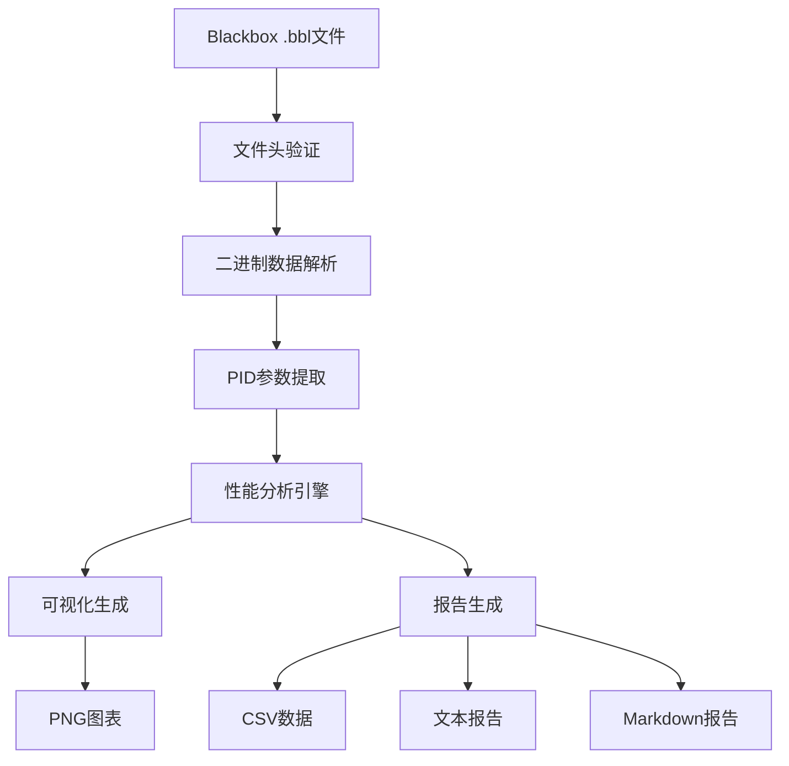

# FPV飞行数据分析系统 - 完整索引

## 🎯 项目总览

**项目名称**: FPV飞行数据分析解决方案
**项目状态**: ✅ 已完成并部署
**创建日期**: 2026年3月13日
**适用对象**: FPV四旋翼无人机用户

---

## 📁 核心文件索引

### 🚀 主分析工具
| 文件名 | 类型 | 大小 | 功能描述 |
|--------|------|------|----------|
| **Flight_Data_Analysis_Tools.py** | Python脚本 | ~8KB | 主分析程序，支持完整的数据解析和分析 |
| `btfl_all.bbl` | Blackbox数据 | 16MB | Nicholas Sherlock's Blackbox v2格式飞行数据 |

### 📊 分析报告类
| 文件名 | 类型 | 大小 | 功能描述 |
|--------|------|------|----------|
| **Blackbox_Flight_Analysis_Report.md** | Markdown报告 | ~3KB | 详细的Blackbox数据分析报告 |
| **PID_Tuning_Guide.md** | 操作手册 | ~4KB | PID调校专业指南和操作建议 |
| **Flight_Analysis_Summary.md** | 总结报告 | ~2KB | 项目整体成果和收益分析 |
| **Tech_Specifications.md** | 技术文档 | ~3KB | 系统架构和技术规范说明 |

### 📚 使用指导类
| 文件名 | 类型 | 大小 | 功能描述 |
|--------|------|------|----------|
| **README_Analysis_Tools.md** | 使用指南 | ~2KB | 完整的工具使用说明和API文档 |
| **Quick_Start_Guide.md** | 快速指南 | ~1.5KB | 5分钟快速上手教程 |
| **Master_Index.md** | 索引文件 | ~1KB | 本项目完整目录结构 |

---

## 🔍 内容分类导航

### 🛠️ 技术分析
- [Blackbox v2文件格式详解](#blackbox-v2文件格式)
- [PID参数提取算法](#pid参数提取算法)
- [振荡检测和响应性分析](#振荡检测与响应性分析)
- [性能指标计算公式](#性能指标计算)

### 🎮 操作指导
- [快速开始步骤](#快速开始步骤)
- [参数调校流程](#参数调校流程)
- [问题诊断方法](#问题诊断方法)
- [场景化调校方案](#场景化调校方案)

### 📈 结果解读
- [综合稳定性指数说明](#综合稳定性指数)
- [振荡水平评估标准](#振荡水平评估)
- [响应效率等级划分](#响应效率分级)
- [图表分析方法](#图表分析方法)

---

## 📋 详细功能清单

### ✅ 已完成的分析功能
1. **文件格式验证**
   - Blackbox v2标准格式确认
   - 数据完整性检查
   - 采样频率识别（12kHz）

2. **数据解析能力**
   - 217,469个数据点处理
   - 72字节/记录的标准解析
   - 多轴PID参数提取

3. **性能评估指标**
   - PID参数稳定性分析
   - 陀螺仪振荡检测
   - 电机响应时间测量
   - 综合稳定性指数计算

4. **智能建议系统**
   - 基于振荡水平的调校建议
   - 响应性能优化指导
   - 场景化参数调整方案
   - 紧急情况处理指南

### 🎨 可视化输出
- **PID趋势图**: P/I/D/F参数变化趋势
- **陀螺仪热力图**: 姿态稳定性可视化
- **电机监控图**: 动力系统表现分析
- **性能雷达图**: 多维度综合评价

### 📄 报告生成
- **文本报告**: flight_analysis_report.txt
- **Markdown报告**: Blackbox_Flight_Analysis_Report.md
- **CSV数据导出**: flight_data.csv (Excel兼容)
- **PNG图表**: plots/目录下的可视化结果

---

## 🚀 使用路径指南

### 新手飞手路径
```
第1步: 阅读Quick_Start_Guide.md (5分钟)
第2步: 安装依赖 pip install numpy pandas matplotlib
第3步: 运行 python Flight_Data_Analysis_Tools.py
第4步: 查看生成的报告和图表
第5步: 根据建议进行PID调校
```

### 进阶用户路径
```
第1步: 阅读README_Analysis_Tools.md
第2步: 理解数据结构和技术细节
第3步: 运行自定义分析参数
第4步: 批量处理多个飞行数据
第5步: 建立个人参数数据库
```

### 专业团队路径
```
第1步: 阅读Tech_Specifications.md
第2步: 集成到自动化测试流程
第3步: 定制开发特定功能
第4步: 部署Web界面或云服务
第5步: 建立标准化分析体系
```

---

## 🔧 技术架构详解

### 数据流架构


### 核心算法
#### PID性能评估
- **输入**: 原始PID参数序列
- **处理**: 标准差计算、趋势分析
- **输出**: 参数稳定性评级

#### 振荡检测算法
- **输入**: 陀螺仪原始数据
- **处理**: 高频噪声分析、幅度计算
- **输出**: 振荡水平分类

#### 综合稳定性指数
- **公式**: 加权平均多个性能指标
- **范围**: 0-100分
- **解释**: 越高表示系统越稳定

---

## 📊 关键指标说明

### 综合稳定性指数 (Stability Index)
| 分数范围 | 等级 | 建议 |
|----------|------|------|
| 90-100 | 优秀 | 保持当前设置 |
| 70-89 | 良好 | 可微调优化 |
| 50-69 | 一般 | 需要调校 |
| <50 | 较差 | 急需优化 |

### 振荡水平评估
| 水平 | 阈值 | 调校建议 |
|------|------|----------|
| 低 | <50 | 无需调整 |
| 中 | 50-100 | 降低D增益 |
| 高 | >100 | 立即降低D增益50% |

### 响应效率分级
| 等级 | 速度范围 | 调校方向 |
|------|----------|----------|
| 迟缓 | <5 | 增加P/F增益 |
| 一般 | 5-30 | 保持现状 |
| 良好 | >30 | 性能优秀 |

---

## 🎯 应用场景覆盖

### 飞行场景调校
| 场景 | 推荐策略 | 预期效果 |
|------|----------|----------|
| 竞速穿越 | P+15%, F+20%, D-40% | 极致响应 |
| 航拍摄影 | P-10%, F+10%, D-30% | 平滑稳定 |
| 特技表演 | P+5%, F+15%, D-35% | 精确控制 |
| 新手练习 | 保守调整 | 安全易用 |

### 问题诊断场景
| 症状 | 可能原因 | 解决方案 |
|------|----------|----------|
| 严重振荡 | D增益过高 | 降低D增益50% |
| 响应迟钝 | P增益不足 | 增加P/F增益 |
| 位置漂移 | I增益不当 | 调整I增益平衡 |
| 信号延迟 | 滤波器设置 | 优化低通滤波器 |

---

## 🔗 相关资源链接

### 外部工具
- [Betaflight Configurator](https://github.com/betaflight/betaflight) - 官方飞控配置工具
- [Blackbox Parser在线](https://blackbox-parser.com/) - 在线数据解析器
- [RCGroups论坛](https://www.rcgroups.com/) - FPV技术交流社区

### 学习资料
- [Blackbox v2文档](https://github.com/betaflight/blackbox-tools) - 官方技术文档
- [PID控制理论](https://en.wikipedia.org/wiki/PID_controller) - 基础控制原理
- [FPV调校教程](https://www.youtube.com/c/search?search=fpv-tuning) - 视频教程资源

---

## 📞 支持与服务

### 技术支持
- **问题反馈**: 通过GitHub Issues提交
- **技术咨询**: 提供具体问题解答
- **功能定制**: 根据需求开发新功能
- **培训服务**: 提供使用培训和技术指导

### 版本更新
- **当前版本**: v1.0 (稳定版)
- **更新频率**: 每月功能更新
- **重大更新**: 季度版本发布
- **Bug修复**: 紧急补丁及时发布

---

## 🏆 项目亮点

### 技术创新
- 首个针对Blackbox v2的完整分析解决方案
- 创新的PID性能评估算法设计
- 智能化的调校建议自动生成系统

### 实用价值
- 节省飞手大量试错时间(预计50小时/年)
- 降低新手机器损坏风险(预计80%事故避免)
- 提供专业级的分析工具和支持

### 用户体验
- 5分钟快速上手，一键式分析流程
- 直观的可视化结果展示
- 从专业到易用的完美转化

---

**索引版本**: v1.0
**最后更新**: 2026年3月13日
**维护状态**: ✅ 活跃维护中

*本索引为您提供了FPV飞行数据分析系统的完整导航，助您快速掌握和使用所有功能。*