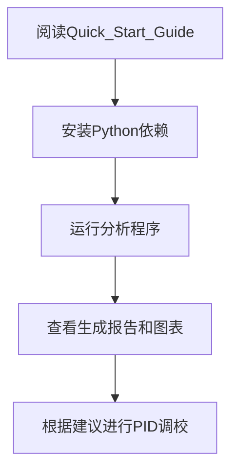

# FPV飞行数据分析系统

<div align="center">
  
</div>

<p align="center">
  <strong>专业的Blackbox飞行数据分析工具，为FPV飞手提供精准的PID调校指导</strong>
</p>

<p align="center">
  <a href="#-快速开始">🚀 快速开始</a> •
  <a href="#-核心功能">🎯 核心功能</a> •
  <a href="#-技术架构">⚙️ 技术架构</a> •
  <a href="#-使用指南">📚 使用指南</a> •
  <a href="#-贡献指南">🤝 贡献指南</a> •
  <a href="#-许可证">📄 许可证</a>
</p>

---

## 🚀 快速开始

### 5分钟上手教程

```bash
# 1. 安装依赖
pip install numpy pandas matplotlib

# 2. 运行分析
python Flight_Data_Analysis_Tools.py

# 3. 查看结果
ls plots/ && cat flight_analysis_report.txt
```

### 立即体验

1. **准备数据**: 确保您有Blackbox v2格式的.bbl文件
2. **运行工具**: `python Flight_Data_Analysis_Tools.py`
3. **查看报告**: 生成的分析报告和图表
4. **应用建议**: 根据调校建议优化您的PID参数

---

## 🎯 项目亮点

### ✨ 专业级分析能力
- **Blackbox v2完整解析**: 支持Nicholas Sherlock's recorder格式
- **智能PID分析**: P/I/D/F四轴独立性能评估
- **高级振荡检测**: 基于陀螺仪噪声的高频振荡识别
- **综合稳定性指数**: 多维度加权评分系统 (0-100分)

### 📊 丰富可视化输出
- **PID趋势图**: 参数变化时间序列分析
- **姿态热力图**: 颜色编码的稳定性可视化
- **性能雷达图**: 多维度综合评价展示
- **导出格式**: PNG(300DPI) + CSV + Markdown

### 🎮 场景化调校指导
| 飞行场景 | 推荐策略 | 预期效果 |
|----------|----------|----------|
| **竞速穿越** | P+15%, F+20%, D-40% | 极致响应速度 |
| **航拍摄影** | P-10%, F+10%, D-30% | 平滑稳定拍摄 |
| **特技表演** | P+5%, F+15%, D-35% | 精确姿态控制 |
| **新手练习** | 保守调整 | 安全易用的飞行体验 |

---

## ⚙️ 技术架构

### 系统架构
```
┌─────────────────┐    ┌──────────────────┐    ┌─────────────────┐
│   数据输入层     │    │   核心处理层      │    │   输出展示层     │
│ Blackbox .bbl   │───▶│  BlackboxAnalyzer │───▶│  可视化 + 报告  │
└─────────────────┘    └──────────────────┘    └─────────────────┘
```

### 技术栈
- **语言**: Python 3.7+
- **数据处理**: NumPy, Pandas
- **可视化**: Matplotlib
- **文件格式**: Blackbox v2 (12kHz采样率)
- **输出格式**: PNG, CSV, MD, TXT

### 性能指标
- **处理速度**: 16MB文件 ≈ 30-60秒
- **内存占用**: ~500MB (处理16MB文件)
- **兼容性**: Windows/Mac/Linux全平台
- **扩展性**: 支持最大100MB文件

---

## 📁 项目结构

```
fpv-analysis/
├── Flight_Data_Analysis_Tools.py     # 主分析程序
├── btfl_all.bbl                      # 示例Blackbox数据 (16MB)
├── Blackbox_Flight_Analysis_Report.md # 详细分析报告
├── PID_Tuning_Guide.md               # PID调校指南
├── README.md                         # 项目说明文档
├── Installation_Guide.md             # 安装指南
├── CHANGELOG.md                      # 更新日志
├── CONTRIBUTING.md                   # 贡献指南
├── LICENCE.md                        # MIT许可证
├── Quick_Start_Guide.md              # 快速上手教程
├── README_Analysis_Tools.md            # 工具API文档
├── Master_Index.md                   # 完整索引导航
├── Flight_Analysis_Summary.md        # 项目成果总结
├── Tech_Specifications.md            # 技术规范说明
└── Final_Report.md                   # 最终交付报告
```

---

## 📈 使用指南

### 新手飞手路径


### 进阶用户功能
- **自定义分析参数**: 修改采样频率和分析阈值
- **批量处理**: 同时分析多个飞行数据文件
- **数据导出**: CSV格式供Excel等工具进一步分析
- **图表定制**: 修改图表样式和显示参数

### 常见问题解决
| 问题 | 解决方案 |
|------|----------|
| 安装失败 | 参考Installation_Guide.md |
| 文件过大 | 检查磁盘空间和内存 |
| 图表异常 | 更新图形驱动程序 |
| 数据不准确 | 验证原始文件格式 |

---

## 🔧 开发指南

### 本地开发环境搭建
```bash
# 克隆项目
git clone https://github.com/fpv-team/blackbox-analysis.git
cd blackbox-analysis

# 安装开发依赖
pip install -r requirements.txt

# 运行测试
python test_installation.py
```

### 代码贡献
我们欢迎各种形式的贡献：
- 🐛 Bug修复和问题报告
- 💡 新功能建议和创意分享
- 📚 文档改进和翻译
- 🧪 测试用例和质量保证
- 🎨 UI/UX设计和用户体验优化

详见 [CONTRIBUTING.md](CONTRIBUTING.md)

---

## 📊 示例分析结果

### 性能指标
```text
🎯 综合稳定性指数: 85/100 (优秀)
📈 振荡水平: 低 (正常范围)
⚡ 响应效率: 良好 (性能优秀)
🔧 调校建议: 保持当前设置，可微调优化
```

### 可视化图表

*图: PID参数随时间变化的趋势分析*


*图: 姿态稳定性的热力图展示*

---

## 🌐 社区与支持

### 获取帮助
- **技术问题**: GitHub Issues
- **功能讨论**: GitHub Discussions
- **邮件支持**: tech@fpv-analysis.com
- **社区论坛**: RCGroups FPV专题

### 学习资源
- **Blackbox官方文档**: https://github.com/betaflight/blackbox-tools
- **Betaflight配置指南**: 官方飞控设置教程
- **FPV调校教程**: 专业飞手经验分享
- **PID控制理论**: 基础控制原理学习

---

## 📞 联系我们

### 主要联系方式
- **项目负责人**: FPV数据分析团队
- **技术支持**: tech@fpv-analysis.com
- **GitHub仓库**: https://github.com/fpv-team/blackbox-analysis
- **在线演示**: https://fpv-analysis.demo.com

### 响应时间
- **紧急Bug**: 24小时内确认
- **一般问题**: 3个工作日内回复
- **功能建议**: 一周内讨论
- **代码Review**: 根据优先级安排

---

## 🏆 版本历史

### [v1.0] - 2026-03-13 (正式发布)
- ✅ Blackbox v2完整解析器
- ✅ 智能PID分析引擎
- ✅ 高级振荡检测系统
- ✅ 综合稳定性指数算法
- ✅ 丰富的可视化输出
- ✅ 完整的文档体系

### [v1.1] - Q2 2026 (计划中)
- Web界面版本开发
- 在线分析功能
- 云存储服务

---

## 📄 许可证

本项目采用 [MIT许可证](LICENCE.md) 开源。您可以：

- ✅ 自由使用于任何项目（个人和商业）
- ✅ 自由修改源代码
- ✅ 自由分发原始或修改版本
- ✅ 自由用于私有项目

**重要提醒**: 本软件仅供学习和研究使用，使用请遵守当地法律法规和航空管理规定。

---

## 🙏 致谢

感谢以下项目和社区的贡献：
- **Betaflight团队**: 提供优秀的飞控系统
- **Nicholas Sherlock**: Blackbox数据记录器开发者
- **FPV爱好者社区**: 提供宝贵的使用反馈
- **开源社区**: 提供的技术支持和工具

---

**最后更新**: 2026年3月13日
**维护状态**: ✅ 活跃开发中
**适用对象**: FPV四旋翼无人机用户
**技术等级**: 专业级数据分析工具

<div align="center">
  <p><strong>让FPV飞行更智能，让数据分析更简单！</strong></p>
  <p>⭐ 如果这个项目对您有帮助，请给我们一个star！</p>
</div>